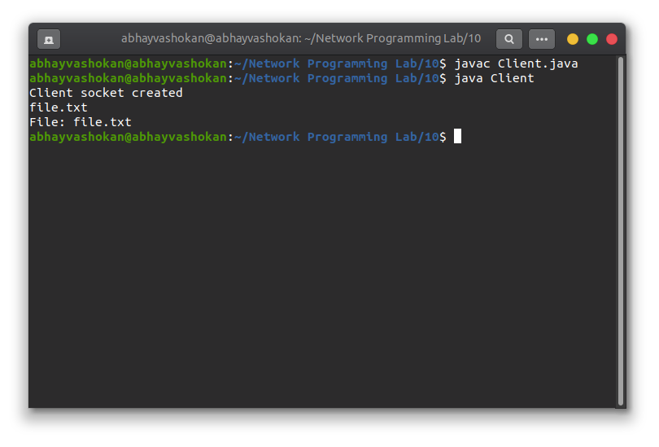
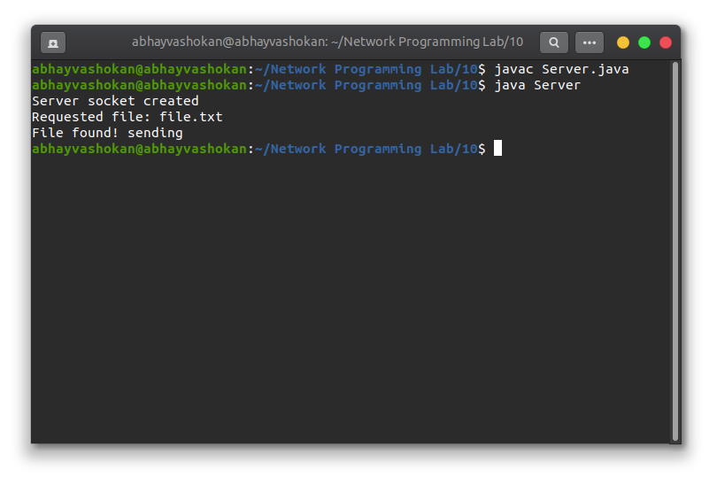

## Program

**Server.java**
``` java
// Develop concurrent file server which will provide the file requested by client if it exists. If not, the server sends an appropriate message to the client. Server should also send its process ID (PID) to clients for display along with file or the message.

import java.io.*;
import java.net.*;

class Server {
  public static void main(String[] args) {
    while (true) {
      Socket cs = null;
      String file = null;
      ServerSocket socket = null;
      BufferedOutputStream outToClient = null;

      try {
        socket = new ServerSocket(3000);
        cs = socket.accept();
        DataInputStream dis = new DataInputStream(cs.getInputStream());
        outToClient = new BufferedOutputStream(cs.getOutputStream());
        file = dis.readUTF();

        System.out.println("Server socket created");
      } catch (IOException ex) {
      }

      if (outToClient != null) {

        System.out.println("Requested file: " + file);
        File myFile = new File(file);

        if (myFile.exists())
          System.out.println("File found! sending");

        else
          System.out.println("File not found");
        FileInputStream fis = null;
        byte[] mybytearray = new byte[(int) myFile.length()];
        try {
          fis = new FileInputStream(myFile);
        } catch (FileNotFoundException ex) {
        }
        BufferedInputStream bis = new BufferedInputStream(fis);

        try {
          bis.read(mybytearray, 0, mybytearray.length);
          outToClient.write(mybytearray, 0, mybytearray.length);
          outToClient.flush();
          outToClient.close();
          cs.close();

          return;
        } catch (IOException ex) {
        }
      }
    }
  }
}

```

**Client.java**
```java
import java.net.*;
import java.io.*;

class Client {
  public static void main(String[] args) {
    int bytesRead;
    byte[] aByte = new byte[1];
    ByteArrayOutputStream baos = new ByteArrayOutputStream();

    try {
      Socket s = new Socket("127.0.0.1", 3000);
      System.out.println("Client socket created");

      DataOutputStream dos = new DataOutputStream(s.getOutputStream());
      DataInputStream dis = new DataInputStream(s.getInputStream());
      InputStream is = s.getInputStream();
      BufferedReader br = new BufferedReader(new InputStreamReader(System.in));
      String req = br.readLine();

      System.out.println("File: " + req);
      dos.writeUTF(req);
      FileOutputStream fos = null;
      fos = new FileOutputStream(req);
      BufferedOutputStream bos = new BufferedOutputStream(fos);
      bytesRead = is.read(aByte, 0, aByte.length);

      do {
        baos.write(aByte);
        bytesRead = is.read(aByte);
      } while (bytesRead != -1);

      bos.write(baos.toByteArray());
      bos.flush();
      bos.close();
      s.close();
    } catch (Exception e) {
    }

  }
}

```

## Output

### Screenshots

 


### Output

**Server**
```
Server socket created
Requested file: file.txt
File found: sending
```

**Client**
```
Client socket created
file.txt
File: file.txt
```

### ReadMe
1. Open first terminal
    1. ```javac Server.java```
    2. ```java Server```
   
2. Open second terminal
   1. ```javac Client.java```
   2. ```java Client```

3. Type the name of the file requested in the client side and hit enter for the file to be shared.