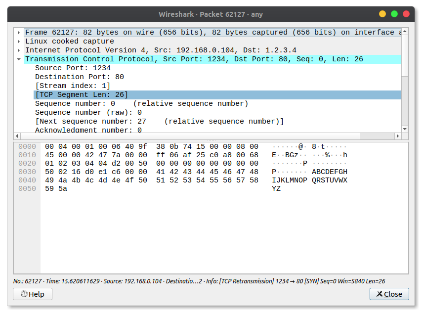
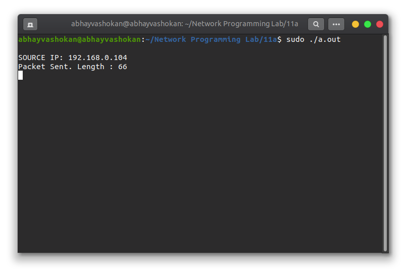
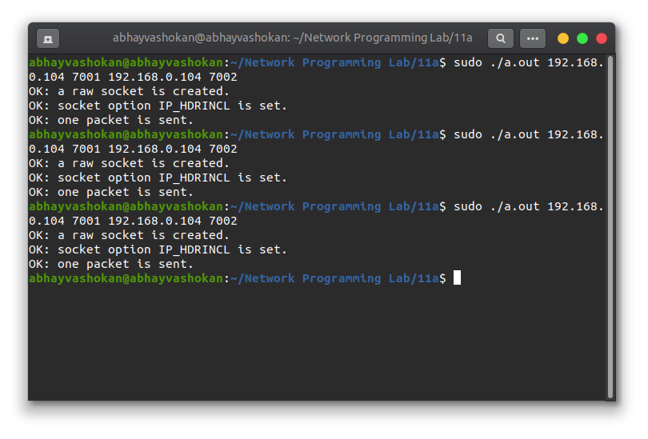
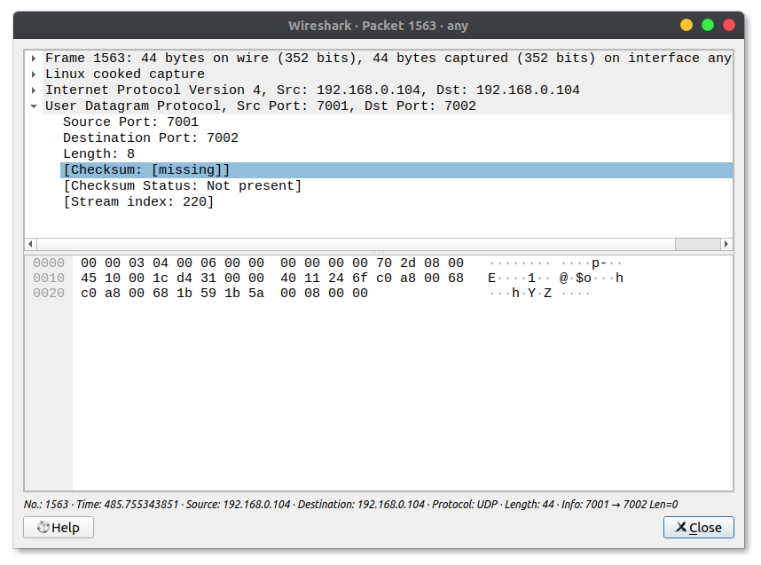

## Program

```c
#include <stdio.h>
#include <string.h>
#include <errno.h>
#include <sys/socket.h>
#include <netinet/in.h>
#include <time.h>
#define PORT_FTP 21
#define SERVER_ADDR "192.168.0.104"
#define MAXBUF 1024
int main()
{
    int sockfd;
    struct sockaddr_in dest;
    char buffer[MAXBUF];
    if ((sockfd = socket(AF_INET, SOCK_STREAM, 0)) < 0)
    {
        perror("Socket");
        exit(errno);
    }
    bzero(&dest, sizeof(dest));
    dest.sin_family = AF_INET;
    dest.sin_port = htons(PORT_FTP);
    if (inet_aton(SERVER_ADDR, &dest.sin_addr.s_addr) == 0)
    {
        perror(SERVER_ADDR);
        exit(errno);
    }
    if (connect(sockfd, (struct sockaddr *)&dest, sizeof(dest)) != 0)
    {
        perror("Connect ");
        exit(errno);
    }
    bzero(buffer, MAXBUF);
    recv(sockfd, buffer, sizeof(buffer), 0);
    printf("%s", buffer);
    close(sockfd);
    return 0;
}

```

## Output

### Screenshots

**1. TCP**

  

**2. UDP**

  

### Output

```
SOURCE IP: 192.168.0.104
Packet Sent. Length : 66
```

### ReadMe

1. Run the python server using ```python3 -m http.server```
2. Compile and run the file ```fileserver.c```.
	```
	gcc fileserver.c
	sudo ./a.out
	```
3. Now run the ftp server using the ip address
	```
	ftp 192.168.0.104
	```