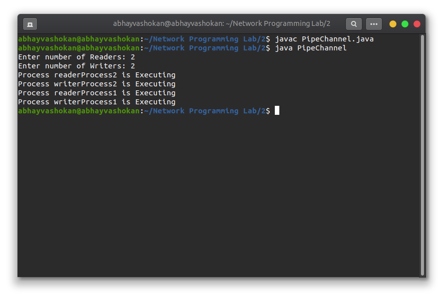

## Program

``` java
// Implement the Second Readers-Writers problem (Using Process along with PIPE and Message Queue)

import java.io.IOException;
import java.util.Scanner;
import java.io.PipedInputStream;
import java.io.PipedOutputStream;

public class PipeChannel {

    public static void main(String[] args) throws IOException {

        final PipedOutputStream output = new PipedOutputStream();
        final PipedInputStream input = new PipedInputStream(output);
        int readerNo, writerNo;
        Thread readThread[] = new Thread[10];
        Thread writeThread[] = new Thread[10];
        Scanner scan = new Scanner(System.in);
        System.out.print("Enter number of Readers: ");
        readerNo = scan.nextInt();
        System.out.print("Enter number of Writers: ");
        writerNo = scan.nextInt();
        scan.close();
        if (readerNo < 0) {
            System.out.println("Error Message");
            System.exit(0);
        }
        if (writerNo < 0) {
            System.out.println("Error Message");
            System.exit(0);
        }
        for (int i = 1; i <= readerNo; i++) {
            readThread[i] = new Thread(new Runnable() {
                @Override
                public void run() {
                    try {
                        System.out.println("Process " + Thread.currentThread().getName() + " is Executing");
                        int data = input.read();
                        while (data != -1) {
                            data = input.read();
                        }
                        input.close();

                    } catch (IOException e) {
                    }
                }
            });
            readThread[i].setName("readerProcess" + i);
        }
        for (int i = 1; i <= writerNo; i++) {
            writeThread[i] = new Thread(new Runnable() {
                @Override
                public void run() {
                    try {
                        output.write(Thread.currentThread().getName().getBytes());
                        System.out.println("Process " + Thread.currentThread().getName() + " is Executing");
                    } catch (IOException e) {
                    }
                }
            });
            writeThread[i].setName("writerProcess" + i);
        }
        int j = 1, k = 1;
        if (readerNo == 0) {
            while (k <= writerNo) {
                writeThread[k].start();
                k++;
            }
        } else if (writerNo == 0) {
            while (j <= readerNo) {
                readThread[j].start();
                j++;
            }
        } else {
            while (j <= readerNo && k <= writerNo) {

                writeThread[k].start();
                readThread[j].start();
                j++;
                k++;
            }
            while (j <= readerNo) {
                readThread[j].start();
                j++;
            }
            while (k <= writerNo) {
                writeThread[k].start();
                k++;
            }
        }

    }
}

```
## Output

### Screenshot




### Output

```
Enter number of Readers: 2
Enter number of Writers: 2
Process writerProcess1 is Executing
Process writerProcess2 is Executing
Process readerProcess1 is Executing
Process readerProcess2 is Executing
``` 

### ReadMe
1. ```javac PipeChannel.java```
2. ```java PipeChannel```