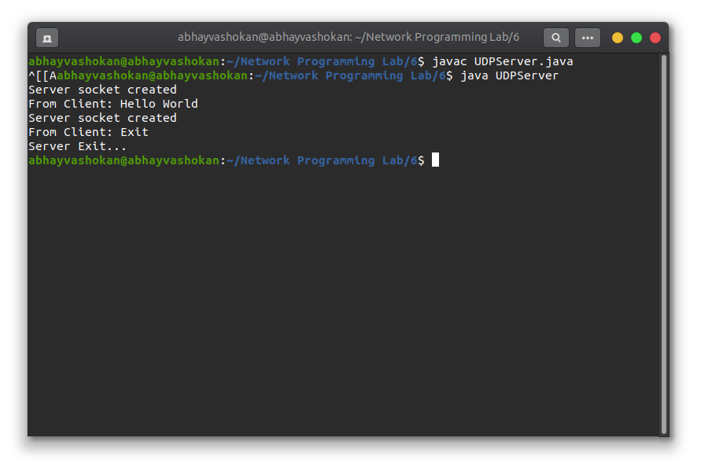
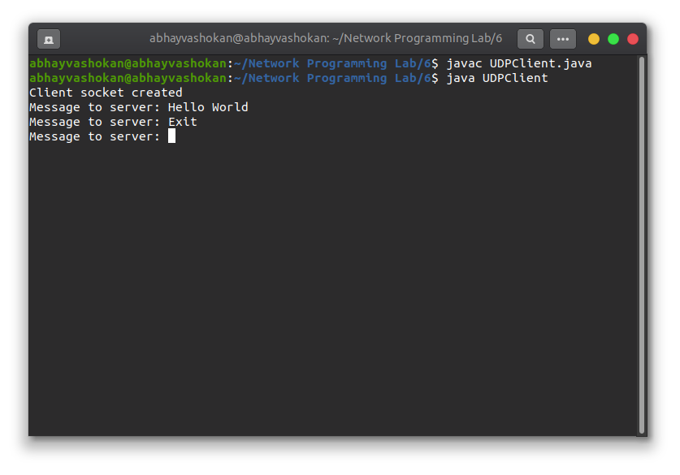

## Program

**UDPServer.java**
``` java
import java.io.IOException;
import java.net.DatagramPacket;
import java.net.DatagramSocket;
import java.net.InetAddress;
import java.net.SocketException;

public class UDPServer {
    public static void main(String[] args) throws IOException {
        // Step 1 : Create a socket to listen at port 1234
        DatagramSocket ds = new DatagramSocket(1234);
        byte[] receive = new byte[65535];

        DatagramPacket DpReceive = null;
        while (true) {

            // Step 2 : create a DatgramPacket to receive the data.
            DpReceive = new DatagramPacket(receive, receive.length);
            System.out.println("Server socket created");

            // Step 3 : revieve the data in byte buffer.
            ds.receive(DpReceive);

            System.out.println("From Client: " + data(receive));

            // Exit the server if the client sends "bye"
            if (data(receive).toString().equals("Exit")) {
                System.out.println("Server Exit...");
                break;
            }

            // Clear the buffer after every message.
            receive = new byte[65535];
        }
        ds.close();
    }

    // A utility method to convert the byte array
    // data into a string representation.
    public static StringBuilder data(byte[] a) {
        if (a == null)
            return null;
        StringBuilder ret = new StringBuilder();
        int i = 0;
        while (a[i] != 0) {
            ret.append((char) a[i]);
            i++;
        }
        return ret;
    }
}
```

**UDPClient.java**
```java
import java.io.IOException;
import java.net.DatagramPacket;
import java.net.DatagramSocket;
import java.net.InetAddress;
import java.util.Scanner;

public class UDPClient {
    public static void main(String args[]) throws IOException {
        Scanner sc = new Scanner(System.in);

        // Step 1:Create the socket object for
        // carrying the data.
        DatagramSocket ds = new DatagramSocket();
        System.out.println("Client socket created");

        InetAddress ip = InetAddress.getLocalHost();
        byte buf[] = null;

        // loop while user not enters "bye"
        while (true) {
            System.out.print("Message to server: ");
            String inp = sc.nextLine();

            // convert the String input into the byte array.
            buf = inp.getBytes();

            // Step 2 : Create the datagramPacket for sending
            // the data.
            DatagramPacket DpSend = new DatagramPacket(buf, buf.length, ip, 1234);

            // Step 3 : invoke the send call to actually send
            // the data.
            ds.send(DpSend);

            // break the loop if user enters "bye"
            if (inp.equals("bye"))
                break;
        }
        sc.close();
        ds.close();
    }
}
```

## Output

### Screenshots

  


### Output

**Server**
```
Server socket created
From Client: Hello World
Server socket created
From Client: Exit
Server Exit...
``` 

**Client**
```
Client socket created
Message to server: Hello World
Message to server: Exit
```

### ReadMe
1. Open first terminal
    1. ```javac UDPServer.java```
    2. ```java UDPServer```
   
2. Open second terminal
   1. ```javac UDPClient.java```
   2. ```java UDPClient```

3. Communicate between Client and Server using the terminal.
4. To exit type: ```Exit``` in Client.