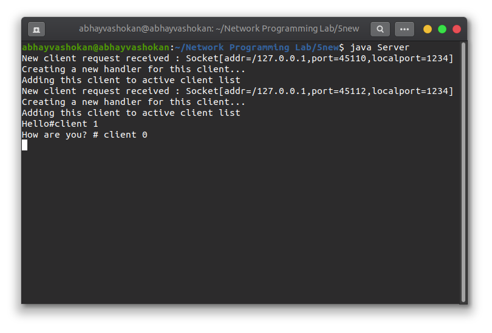
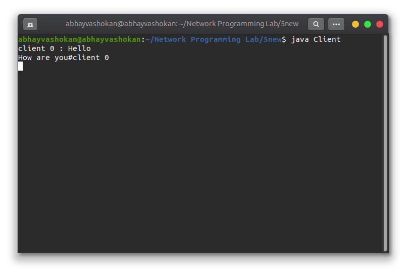

## Program

**server.java**
``` java
import java.io.*;
import java.util.*;
import java.net.*;

public class Server {

	static Vector<ClientHandler> ar = new Vector<>();

	static int i = 0;

	public static void main(String[] args) throws IOException {
		ServerSocket ss = new ServerSocket(8002);

		Socket s;

		while (true) {
			s = ss.accept();
			System.out.println("New client request received : " + s);

			DataInputStream dis = new DataInputStream(s.getInputStream());
			DataOutputStream dos = new DataOutputStream(s.getOutputStream());
			System.out.println("Creating a new handler for this client...");

			ClientHandler mtch = new ClientHandler(s, "client " + i, dis, dos);
			Thread t = new Thread(mtch);
			System.out.println("Adding this client to active client list");

			ar.add(mtch);
			t.start();
			i++;
		}
	}
}

class ClientHandler implements Runnable {
	Scanner scn = new Scanner(System.in);
	private String name;
	final DataInputStream dis;
	final DataOutputStream dos;
	Socket s;
	boolean isloggedin;

	public ClientHandler(Socket s, String name, DataInputStream dis, DataOutputStream dos) {
		this.dis = dis;
		this.dos = dos;
		this.name = name;
		this.s = s;
		this.isloggedin = true;
	}

	@Override
	public void run() {

		String received;
		while (true) {
			try {
				received = dis.readUTF();

				System.out.println(received);

				if (received.equals("logout")) {
					this.isloggedin = false;
					this.s.close();
					break;
				}

				StringTokenizer st = new StringTokenizer(received, "#");
				String MsgToSend = st.nextToken();
				String recipient = st.nextToken();

				for (ClientHandler mc : Server.ar) {
					if (mc.name.equals(recipient) && mc.isloggedin == true) {
						mc.dos.writeUTF(this.name + " : " + MsgToSend);
						break;
					}
				}
			} catch (IOException e) {}
		}
		try {
			this.dis.close();
			this.dos.close();

		} catch (IOException e) {}
	}
}

```

**client.java**
```java
import java.io.*;
import java.net.*;
import java.util.Scanner;

public class Client {
    final static int ServerPort = 8002;

    public static void main(String args[]) throws UnknownHostException, IOException {
        Scanner scn = new Scanner(System.in);
        InetAddress ip = InetAddress.getByName("localhost");
        Socket s = new Socket(ip, ServerPort);

        DataInputStream dis = new DataInputStream(s.getInputStream());
        DataOutputStream dos = new DataOutputStream(s.getOutputStream());

        Thread sendMessage = new Thread(new Runnable() {
            @Override
            public void run() {
                while (true) {
                    String msg = scn.nextLine();

                    try {
                        dos.writeUTF(msg);
                    } catch (IOException e) {}
                }
            }
        });

        Thread readMessage = new Thread(new Runnable() {
            @Override
            public void run() {
                while (true) {
                    try {
                        String msg = dis.readUTF();
                        System.out.println(msg);
                    } catch (IOException e) {}
                }
            }
        });
        sendMessage.start();
        readMessage.start();
    }
}
```

## Output

### Screenshots

 <br>
 


### Output

**Server**
```
New client request received : Socket[addr=/127.0.0.1,port=45114,localport=1234]
Creating a new handler for this client...
Adding this client to active client list
New client request received : Socket[addr=/127.0.0.1,port=45116,localport=1234]
Creating a new handler for this client...
Adding this client to active client list
Hello#client 1
How are you#client 0
``` 

**Client 0**
```
Hello#client 1
client 1 : How are you
```

**Client 1**
```
Hello#client 1
client 1 : How are you
```

### ReadMe
1. Open first terminal
    1. ```javac Server.java```
    2. ```java Server```
   
2. Open second terminal to run client 0
   1. ```javac Client.java```
   2. ```java Client```

3. Open third terminal to run client 1 
   1. ```javac Client.java```
   2. ```java Client```

4. Communicate between Clients and Server using the terminal.
5. The message format is ```<Message>#<Client number>```