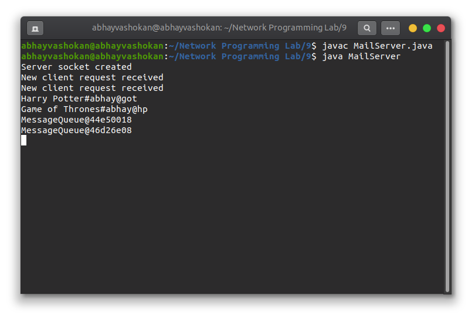
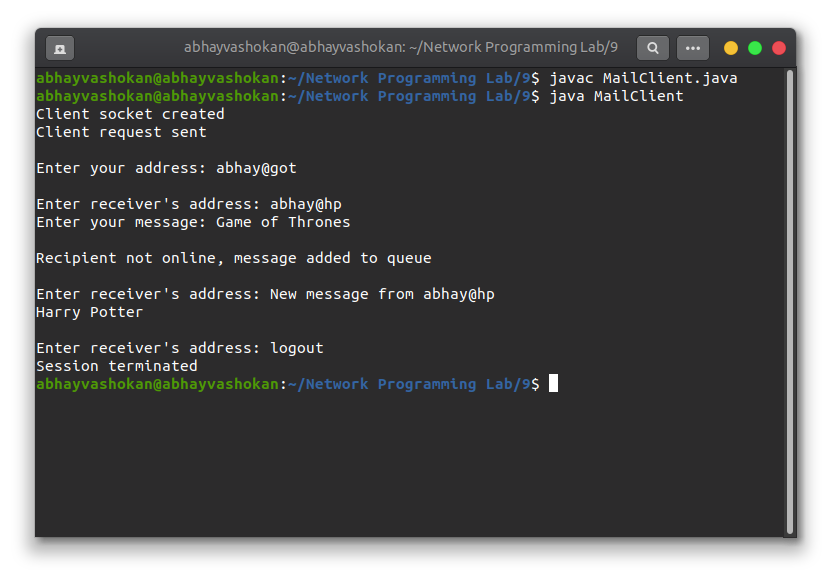
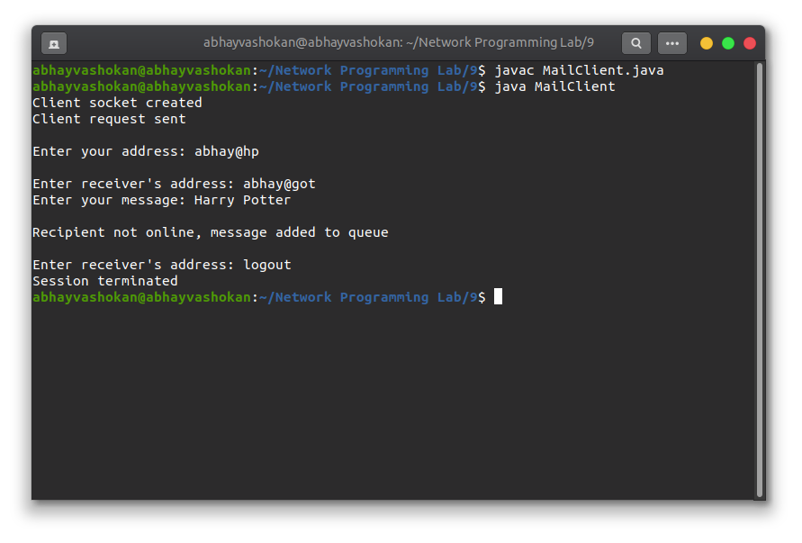

## Program

**MailServer.java**
``` java
import java.io.*;
import java.util.*;
import java.util.concurrent.*;
import java.net.*;

public class MailServer {
    static Vector<ClientHandler> ar = new Vector<>();
    static int i = 0;

    public static void main(final String[] args) throws IOException {
        final ServerSocket serverSocket = new ServerSocket(1729);
        System.out.println("Server socket created");
        Socket socket;
        final ArrayBlockingQueue<MessageQueue> queue = new ArrayBlockingQueue<MessageQueue>(25);

        while (true) {
            socket = serverSocket.accept();
            System.out.println("New client request received");

            final DataInputStream dataInputStream = new DataInputStream(socket.getInputStream());
            final DataOutputStream dataOutputStream = new DataOutputStream(socket.getOutputStream());
            final ClientHandler clientHandler = new ClientHandler(socket, dataInputStream, dataOutputStream, queue);
            final Thread t = new Thread(clientHandler);

            ar.add(clientHandler);
            t.start();
            i++;
        }
    }
}

class ClientHandler implements Runnable {
    private String name;
    final DataInputStream dataInputStream;
    final DataOutputStream dataOutputStream;
    Socket socket;
    boolean isloggedin;
    ArrayBlockingQueue<MessageQueue> queue;

    public ClientHandler(final Socket socket, final DataInputStream dataInputStream, final DataOutputStream dataOutputStream,
            final ArrayBlockingQueue<MessageQueue> queue) {
        this.dataInputStream = dataInputStream;
        this.dataOutputStream = dataOutputStream;
        this.socket = socket;
        this.isloggedin = true;
        this.queue = queue;
    }

    @Override
    public void run() {
        String received;

        try {
            this.name = dataInputStream.readUTF();
        } catch (final IOException e) {
            System.out.println("An IO Exception occured");
        }

        while (true) {
            try {
                for (final MessageQueue q : queue) {
                    if (q.name.equals(name)) {
                        System.out.println(q);
                        dataOutputStream.writeUTF(q.message + "#" + q.sender);
                        queue.remove(q);
                    }
                }

                received = dataInputStream.readUTF();
                System.out.println(received);
                if (received.equals("logout") || received.equals("exit") || received.equals("bye")
                        || received.equals("quit")) {
                    System.out.println("Session terminated");
                    this.isloggedin = false;
                    this.socket.close();
                    break;
                }

                try {
                    final StringTokenizer st = new StringTokenizer(received, "#");
                    final String MsgToSend = st.nextToken();
                    final String recipient = st.nextToken();
                    boolean found = false;
                    for (final ClientHandler mc : SMTPServer.ar) {
                        if (mc.name.equals(recipient) && mc.isloggedin == true) {
                            mc.dataOutputStream.writeUTF(MsgToSend + "#" + this.name);
                            found = true;
                            break;
                        }
                    }
                    if (found == false) {
                        dataOutputStream.writeUTF(
                                "\b\b\b\b\b\b\b\b\b\b\b\b\b\b\b\b\b\b\b\b\b\b\b\b\b\b\b\bRecipient not online, message added to queue");
                        final MessageQueue q = new MessageQueue();
                        q.name = recipient;
                        q.sender = name;
                        q.message = MsgToSend;
                        queue.add(q);
                    }
                } catch (final NoSuchElementException e) {
                    System.out.println(received);
                    System.out.println("Enter address of recipient.");
                }

            } catch (final IOException e) {
            }
        }

        try {
            this.dataInputStream.close();
            this.dataOutputStream.close();

        } catch (final IOException e) {
        }
    }
}

class MessageQueue {
    public String name;
    public String sender;
    public String message;
}
```

**MailClient.java**
```java
import java.net.*;
import java.io.*;
import java.util.*;

public class MailClient {
	final static int ServerPort = 1729;

	public static void main(String args[]) throws UnknownHostException, IOException {
		Scanner scanner = new Scanner(System.in);
		InetAddress ip = InetAddress.getByName("localhost");
		Socket socket = new Socket(ip, ServerPort);

		System.out.println("Client socket created");

		DataInputStream dataInputStream = new DataInputStream(socket.getInputStream());
		DataOutputStream dataOutputStream = new DataOutputStream(socket.getOutputStream());
		System.out.println("Client request sent");

		Thread sendMessage = new Thread(new Runnable() {
			@Override
			public void run() {
				System.out.print("\nEnter your address: ");
				String address = scanner.nextLine();

				try {
					dataOutputStream.writeUTF(address);
				} catch (IOException e) {
					e.printStackTrace();
				}

				while (true) {
					try {
						System.out.print("\nEnter receiver's address: ");
						String recipient = scanner.nextLine();

						if (recipient.equals("logout") || recipient.equals("quit") || recipient.equals("bye")
								|| recipient.equals("exit")) {
							System.out.println("Session terminated");
							System.exit(0);
						} else {
							System.out.print("Enter your message: ");
							String subject = scanner.nextLine();
							dataOutputStream.writeUTF(subject + "#" + recipient);
						}

					} catch (IOException e) {
						System.out.println("An IO Exception occured");
					}
				}
			}
		});

		Thread readMessage = new Thread(new Runnable() {
			@Override
			public void run() {

				while (true) {
					try {
						String received = dataInputStream.readUTF();
						try {
							StringTokenizer st = new StringTokenizer(received, "#");
							String MsgToSend = st.nextToken();
							String sender = st.nextToken();
							System.out.println("New message from " + sender);
							System.out.println(MsgToSend);
							System.out.print("\nEnter receiver's address: ");
						} catch (NoSuchElementException e) {
							System.out.println(received);
							System.out.print("\nEnter receiver's address: ");
						}
					} catch (IOException e) {
						System.out.println("An IO Exception occurred");
					}
				}
			}
		});

		sendMessage.start();
		readMessage.start();
	}
}
```

## Output

### Screenshots

  



### Output

**Server**
```
Server socket created
New client request received
New client request received
Harry Potter#abhay@got
Game of Thrones#abhay@hp
MessageQueue@44e50018
MessageQueue@560b22e7
``` 

**Client 1**
```
Client socket created
Client request sent

Enter your address: abhay@hp

Enter receiver's address: abhay@got
Enter your message: Harry Potter

Recipient not online, message added to queue

Enter receiver's address: logout
Session terminated

```

**Client 2**
```
Client socket created
Client request sent

Enter your address: abhay@got

Enter receiver's address: abhay@hp
Enter your message: Game of Thrones

Recipient not online, message added to queue

Enter receiver's address: New message from abhay@hp
Harry Potter

Enter receiver's address: logout
Session terminated

```

### ReadMe
1. Open first terminal
    1. ```javac MailServer.java```
    2. ```java MailServer```
   
2. Open second terminal
   1. ```javac MailClient.java```
   2. ```java MailClient```

3. Open third terminal in a computer connected to the same network
   1. ```javac MailClient.java```
   2. ```java MailClient```

4. Communicate between the Clients using the terminal.
5. To terminate session type: ```logout``` in Client.